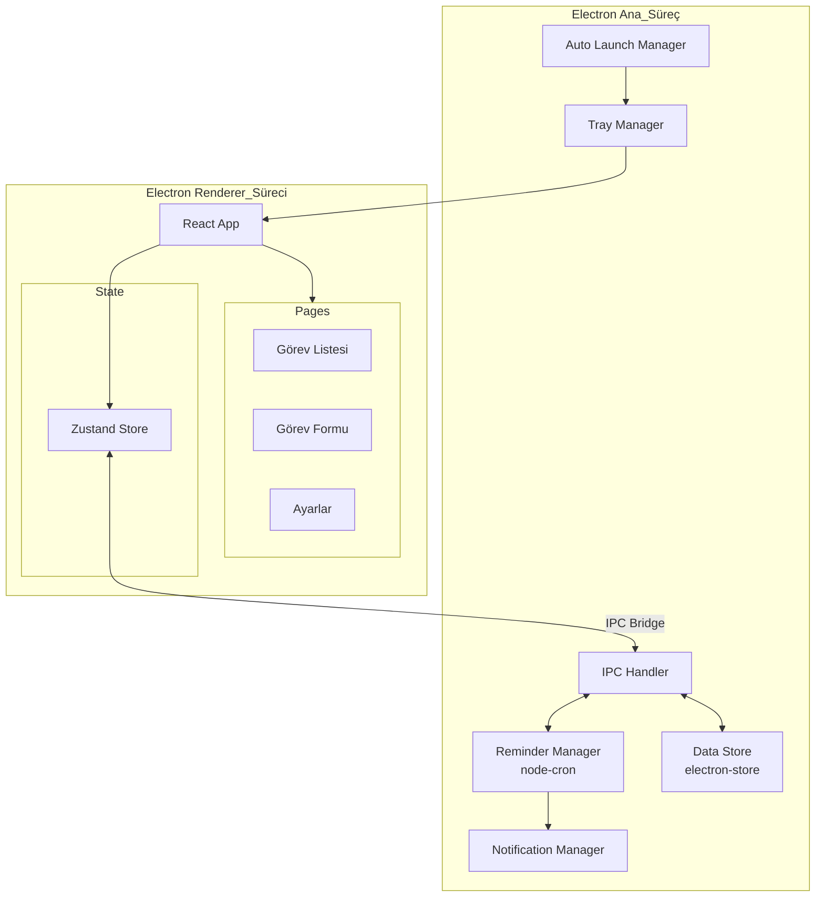

# Tasarım Dokümanı: Kişisel Görev Yönetimi Uygulaması

## Genel Bakış

Bu uygulama, Electron + React + TypeScript ile geliştirilecek tek kullanıcılı bir masaüstü görev yönetim aracıdır. Temel tasarım hedefi minimum RAM kullanımı ile zengin bir kullanıcı deneyimi sunmaktır. Veriler yerel olarak JSON dosyasında saklanır (SQLite'a kıyasla native modül bağımlılığı olmadığı için daha hafiftir). Uygulama Windows başlangıcında sistem tepsisinde açılır ve hatırlatıcıları Ana_Süreç üzerinden yönetir.

### Temel Tasarım Kararları

| Karar | Seçim | Gerekçe |
|-------|-------|---------|
| Veri depolama | JSON dosyası (electron-store) | SQLite native modül gerektirir, JSON daha hafif |
| Durum yönetimi | Zustand | Redux'a kıyasla çok daha hafif (~1KB), boilerplate yok |
| UI kütüphanesi | Tailwind CSS | Runtime CSS-in-JS yükü yok, tree-shaking ile minimal bundle |
| Sanal kaydırma | @tanstack/react-virtual | Hafif, sadece görünür öğeleri render eder |
| Bildirim | Electron native Notification API | Ek kütüphane gerektirmez |
| Zamanlayıcı | node-cron (Ana_Süreç) | Renderer'dan bağımsız, arka planda çalışır |

## Mimari



### Süreç Mimarisi

- **Ana_Süreç**: Veri depolama, hatırlatıcı zamanlama, bildirim gönderme, sistem tepsisi yönetimi ve otomatik başlatma
- **Renderer_Süreci**: React tabanlı kullanıcı arayüzü, tembel yükleme ile bileşen yönetimi
- **IPC Köprüsü**: Ana_Süreç ve Renderer_Süreci arasında güvenli iletişim (contextBridge + preload script)

## Bileşenler ve Arayüzler

### Ana_Süreç Bileşenleri

#### DataStore (electron-store wrapper)
```typescript
interface DataStoreAPI {
  getTasks(): Task[];
  getTask(id: string): Task | undefined;
  addTask(task: Omit<Task, 'id' | 'createdAt'>): Task;
  updateTask(id: string, updates: Partial<Task>): Task;
  deleteTask(id: string): void;
  getSettings(): AppSettings;
  updateSettings(settings: Partial<AppSettings>): AppSettings;
}
```

#### ReminderManager
```typescript
interface ReminderManagerAPI {
  scheduleReminder(taskId: string, reminder: Reminder): void;
  cancelReminder(taskId: string): void;
  rescheduleAll(): void; // Uygulama başlangıcında tüm hatırlatıcıları yeniden zamanla
}
```

#### TrayManager
```typescript
interface TrayManagerAPI {
  createTray(): void;
  updateBadge(pendingCount: number): void;
  showWindow(): void;
  hideToTray(): void;
}
```

#### AutoLaunchManager
```typescript
interface AutoLaunchManagerAPI {
  enable(): Promise<void>;
  disable(): Promise<void>;
  isEnabled(): Promise<boolean>;
}
```

### IPC Kanalları
```typescript
// Renderer → Ana_Süreç
type IPCChannels = {
  'task:getAll': () => Task[];
  'task:get': (id: string) => Task | undefined;
  'task:add': (data: CreateTaskDTO) => Task;
  'task:update': (id: string, updates: Partial<Task>) => Task;
  'task:delete': (id: string) => void;
  'reminder:set': (taskId: string, reminder: Reminder) => void;
  'reminder:cancel': (taskId: string) => void;
  'settings:get': () => AppSettings;
  'settings:update': (settings: Partial<AppSettings>) => AppSettings;
  'app:getAutoLaunch': () => boolean;
  'app:setAutoLaunch': (enabled: boolean) => void;
};
```

### Renderer Bileşenleri

#### Sayfa Bileşenleri (Lazy Loaded)
```typescript
// Tembel yükleme ile sayfa bileşenleri
const TaskListPage = React.lazy(() => import('./pages/TaskListPage'));
const TaskFormPage = React.lazy(() => import('./pages/TaskFormPage'));
const SettingsPage = React.lazy(() => import('./pages/SettingsPage'));
```

#### Zustand Store
```typescript
interface TaskStore {
  tasks: Task[];
  filter: PriorityFilter;
  theme: Theme;
  
  // Actions
  loadTasks: () => Promise<void>;
  addTask: (data: CreateTaskDTO) => Promise<void>;
  updateTask: (id: string, updates: Partial<Task>) => Promise<void>;
  deleteTask: (id: string) => Promise<void>;
  setFilter: (filter: PriorityFilter) => void;
  setTheme: (theme: Theme) => void;
}
```

## Veri Modelleri

```typescript
interface Task {
  id: string;                    // UUID
  title: string;                 // Zorunlu, boş olamaz
  description?: string;          // İsteğe bağlı açıklama
  priority: Priority;            // 'high' | 'medium' | 'low'
  status: TaskStatus;            // 'pending' | 'in_progress' | 'completed'
  reminder?: Reminder;           // İsteğe bağlı hatırlatıcı
  createdAt: string;             // ISO 8601 tarih
  updatedAt: string;             // ISO 8601 tarih
}

type Priority = 'high' | 'medium' | 'low';
type TaskStatus = 'pending' | 'in_progress' | 'completed';

interface Reminder {
  dateTime: string;              // ISO 8601 tarih-saat
  repeat: RepeatInterval;        // 'once' | 'daily' | 'weekly'
  enabled: boolean;
  nextTrigger: string;           // Bir sonraki tetiklenme zamanı (ISO 8601)
}

type RepeatInterval = 'once' | 'daily' | 'weekly';

interface AppSettings {
  autoLaunch: boolean;           // Windows başlangıcında otomatik açılma
  theme: Theme;                  // 'dark' | 'light'
  startMinimized: boolean;       // Sistem tepsisinde küçültülmüş başla
}

type Theme = 'dark' | 'light';

type PriorityFilter = 'all' | Priority;

interface CreateTaskDTO {
  title: string;
  description?: string;
  priority?: Priority;           // Varsayılan: 'low'
  reminder?: Omit<Reminder, 'nextTrigger' | 'enabled'>;
}
```

### JSON Depolama Yapısı
```json
{
  "tasks": [
    {
      "id": "uuid-1",
      "title": "Örnek görev",
      "description": "Açıklama",
      "priority": "high",
      "status": "pending",
      "reminder": {
        "dateTime": "2025-01-15T09:00:00Z",
        "repeat": "daily",
        "enabled": true,
        "nextTrigger": "2025-01-16T09:00:00Z"
      },
      "createdAt": "2025-01-10T10:00:00Z",
      "updatedAt": "2025-01-10T10:00:00Z"
    }
  ],
  "settings": {
    "autoLaunch": true,
    "theme": "dark",
    "startMinimized": true
  }
}
```


## Doğruluk Özellikleri (Correctness Properties)

*Bir özellik (property), bir sistemin tüm geçerli çalışmalarında doğru olması gereken bir davranış veya karakteristiktir. Özellikler, insan tarafından okunabilir spesifikasyonlar ile makine tarafından doğrulanabilir doğruluk garantileri arasında köprü görevi görür.*

### Property 1: Görev CRUD Gidiş-Dönüş (Round-Trip)

*For any* geçerli görev verisi, bir görev oluşturulup kaydedildikten sonra depodan yüklendiğinde, orijinal veri ile eşdeğer olmalıdır. Aynı şekilde, bir görev güncellendiğinde güncellenen alanlar doğru yansımalı, silindiğinde ise depodan tamamen kaldırılmalıdır.

**Validates: Requirements 1.2, 1.5, 1.6, 5.2, 5.3**

### Property 2: Boş/Boşluk Başlık Reddi

*For any* yalnızca boşluk karakterlerinden oluşan string (boş string dahil), bu string ile görev oluşturma girişimi reddedilmeli ve mevcut görev listesi değişmemelidir.

**Validates: Requirements 1.3**

### Property 3: Varsayılan Öncelik Ataması

*For any* öncelik seviyesi belirtilmeden oluşturulan görev, kaydedilen görevin öncelik seviyesi 'low' (Düşük) olmalıdır.

**Validates: Requirements 2.2**

### Property 4: Öncelik Filtreleme Doğruluğu

*For any* görev listesi ve seçilen öncelik filtresi, filtreleme sonucunda dönen tüm görevlerin öncelik seviyesi seçilen filtreyle eşleşmelidir ve eşleşen hiçbir görev sonuç dışında kalmamalıdır.

**Validates: Requirements 2.4**

### Property 5: Bildirim İçeriği Doğruluğu

*For any* hatırlatıcısı olan görev, oluşturulan bildirim payload'u görevin başlığını ve öncelik seviyesini içermelidir.

**Validates: Requirements 3.3**

### Property 6: Hatırlatıcı İptali

*For any* aktif hatırlatıcısı olan görev, hatırlatıcı iptal edildikten sonra görevin hatırlatıcı alanı devre dışı (enabled: false) olmalı veya kaldırılmış olmalıdır.

**Validates: Requirements 3.5**

### Property 7: Tekrarlayan Hatırlatıcı Sonraki Tetikleme Hesaplaması

*For any* tekrarlayan hatırlatıcı (günlük veya haftalık), tetiklendikten sonra hesaplanan nextTrigger değeri, günlük için tam 1 gün (86400000ms), haftalık için tam 7 gün (604800000ms) sonrasına ayarlanmalıdır. Tek seferlik hatırlatıcılar için nextTrigger güncellenmemelidir.

**Validates: Requirements 3.6**

### Property 8: Görev Gruplama Doğruluğu

*For any* görev listesi, durum ve öncelik seviyesine göre gruplama uygulandığında, her gruptaki tüm görevler o grubun durum ve öncelik kriterlerine uymalıdır ve hiçbir görev kaybolmamalıdır (toplam görev sayısı korunmalıdır).

**Validates: Requirements 7.2**

### Property 9: Ayarlar Gidiş-Dönüş (Settings Round-Trip)

*For any* geçerli ayar değeri (tema seçimi dahil), ayar kaydedilip yeniden yüklendiğinde orijinal değer ile eşdeğer olmalıdır.

**Validates: Requirements 7.4**

## Hata Yönetimi

### Veri Depolama Hataları
- Yerel_Depo dosyası bozuk veya okunamaz ise: kullanıcıya hata mesajı göster, boş depo ile başla
- Yazma hatası oluşursa: işlemi geri al, kullanıcıya bildir, yeniden deneme seçeneği sun
- electron-store atomik yazma desteği ile veri bütünlüğü sağlanır

### Hatırlatıcı Hataları
- Geçmiş tarihli hatırlatıcı ayarlanmaya çalışılırsa: kullanıcıya uyarı göster, gelecek bir tarih iste
- Bildirim gönderilemezse: hatayı logla, bir sonraki tetiklemede tekrar dene
- Uygulama kapalıyken kaçırılan hatırlatıcılar: başlangıçta kontrol et, kaçırılanları hemen göster

### Uygulama Hataları
- Renderer_Süreci çökerse: Ana_Süreç pencereyi yeniden oluşturur
- IPC iletişim hatası: retry mekanizması ile 3 deneme, başarısız olursa kullanıcıya bildir
- Beklenmeyen hatalar: global error boundary ile yakalanır, kullanıcıya genel hata mesajı gösterilir

## Test Stratejisi

### Birim Testleri (Unit Tests)
- **Framework**: Vitest (Jest'e kıyasla daha hızlı, daha az bellek kullanır)
- **Kapsam**: Veri modeli doğrulama, filtreleme mantığı, hatırlatıcı hesaplama, IPC handler'lar
- **Odak**: Belirli örnekler, kenar durumlar, hata koşulları
  - Bozuk JSON dosyası ile başlatma (5.4)
  - Geçmiş tarihli hatırlatıcı ayarlama
  - Boş görev listesi ile filtreleme

### Özellik Tabanlı Testler (Property-Based Tests)
- **Kütüphane**: fast-check (TypeScript için en yaygın PBT kütüphanesi)
- **Yapılandırma**: Her test minimum 100 iterasyon
- **Etiketleme**: Her test, tasarım dokümanındaki ilgili property'yi referans alır
  - Format: `Feature: task-reminder-app, Property {number}: {property_text}`
- **Her doğruluk özelliği tek bir property-based test ile uygulanır**

### Test Organizasyonu
```
src/
  __tests__/
    unit/
      dataStore.test.ts        # Veri depolama birim testleri
      taskValidation.test.ts   # Görev doğrulama birim testleri
      reminderCalc.test.ts     # Hatırlatıcı hesaplama birim testleri
    properties/
      taskCrud.property.ts     # Property 1: CRUD round-trip
      taskValidation.property.ts # Property 2: Boş başlık reddi, Property 3: Varsayılan öncelik
      taskFilter.property.ts   # Property 4: Filtreleme doğruluğu
      notification.property.ts # Property 5: Bildirim içeriği
      reminder.property.ts     # Property 6: İptal, Property 7: Sonraki tetikleme
      taskGrouping.property.ts # Property 8: Gruplama doğruluğu
      settings.property.ts     # Property 9: Ayarlar round-trip
```

### Tamamlayıcı Yaklaşım
- Birim testleri belirli örnekleri ve kenar durumları doğrular
- Özellik tabanlı testler evrensel özellikleri rastgele girdilerle doğrular
- İkisi birlikte kapsamlı kapsam sağlar: birim testleri somut hataları yakalar, özellik testleri genel doğruluğu doğrular
